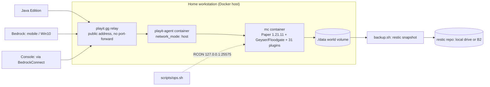

# merric-minecraft

**Infrastructure-as-code for MeteoricCraft** — a Paper 1.21.11 Minecraft server with Bedrock cross-play, run like a small production app. For the Strough family and their friends; hosted by [Merric Strough](https://merricstrough.com).

> Live status & how to connect: **https://merricstrough.com/minecraft**

## What this is

Everything needed to stand up and operate MeteoricCraft lives in this repo: a single `docker-compose.yml` that defines the whole stack, one ops script Merric can drive day-to-day, automated `restic` backups, committed plugin configuration, and a set of ADRs recording *why* each choice was made. The Minecraft world data itself is not in git (too large, and private) — this is the reproducible scaffolding around it.

It's the infrastructure half of the [merricstrough.com](https://merricstrough.com) project family, built side-by-side by Merric (13) and his dad — deliberately readable so a kid can run it and learn how the pieces fit.

## Features

- **Java + Bedrock cross-play** via Geyser + Floodgate — one world, joinable from Java, mobile/Win10 Bedrock, and (with a documented BedrockConnect workaround) consoles.
- **No port-forwarding, home IP hidden** — a [playit.gg](https://playit.gg) tunnel agent relays public traffic; every container port binds to `127.0.0.1` only.
- **31-plugin economy-survival stack** — cross-version compat, permissions (LuckPerms), land-claim protection (GriefPrevention), an economy (Vault + QuickShop + crates + daily rewards + auctions), RPG progression (AuraSkills), custom bosses (MythicMobs), PvP duels, a 3D web map (BlueMap), and branded spawn polish (TAB, holograms). Full manifest in [`docs/PLUGIN-GOVERNANCE.md`](docs/PLUGIN-GOVERNANCE.md).
- **Public economy-server security model** — no whitelist by design (per [ADR-0010](docs/decisions/ADR-0010-public-economy-server-format.md)); the gate is replaced by compensating controls: CoreProtect audit/rollback, anti-combat-log, spawn safe-zone, GriefPrevention claims, and active moderation.
- **Atomic daily backups** — `restic` snapshots with a quiesced world (`save-off` → snapshot → `save-on`), 7-day rolling retention, and an interactive restore path with a typed `RESTORE` confirmation. 3-2-1 strategy and quarterly restore drills per [ADR-0006](docs/decisions/ADR-0006-backup-restore-strategy.md).
- **One ops script** — `scripts/ops.sh` wraps the whole lifecycle (start/stop/status/logs/console/backup/restore/update) so there's exactly one command to remember.
- **Committed, data-driven content** — crate loot tables, holograms, custom bosses, daily rewards, duels arenas, and villager shops live as config in `config/`, not tribal knowledge.
- **Light CI** — GitHub Actions runs `shellcheck` on the scripts and validates `docker compose config` on every push/PR; Dependabot watches Actions versions.
- **Child-safety posture baked in** — Discord integration ships as event-notification-only (no chat bridge without an explicit decision); web-map player markers are off by policy. See [`docs/CHILD-SAFETY-PRIVACY.md`](docs/CHILD-SAFETY-PRIVACY.md).

## Architecture

Two Docker services: the Paper server (`mc`) and the playit tunnel agent. Players reach a public playit.gg address that relays, through the local agent, to localhost-bound ports on the home workstation. Nothing else is exposed. World data is a mounted volume that `restic` snapshots on a nightly cron.



- **`mc`** — `itzg/minecraft-server:java25`, Paper 1.21.11, modern (MEOWICE) JVM flags, 6G heap inside an 8G/4-CPU container cap, `mc-health` healthcheck, auto-pause when idle, and crash-on-OOM. `ONLINE_MODE=false` (required for Floodgate). RCON is enabled but bound to localhost only.
- **`playit`** — `playit-agent` on `network_mode: host`, started only once `mc` reports healthy.
- **Plugins** are provisioned at boot from three sources: **5 pinned direct-download URLs** (Geyser, Floodgate, Vault, EssentialsX + Spawn), **25 Modrinth projects** (auto-resolved to 1.21.11-compatible builds, with dependencies), and **1 manual JAR** (CoreProtect, dropped into `data/plugins/`). Paper bundles `spark` natively — do not install it separately.

The live status widget shown on the website is **not** in this repo; it lives in the website repo's worker (see [ADR-0009](docs/decisions/ADR-0009-status-widget-worker-location.md)).

## Tech stack

| Layer | Choice |
|---|---|
| Server | Paper 1.21.11 (`itzg/minecraft-server:java25`) |
| Cross-play | Geyser + Floodgate (Bedrock ⇄ Java) |
| Networking | playit.gg tunnel agent (host network, no port-forward) |
| Orchestration | Docker Compose |
| Backups | restic (atomic snapshots, 7-day retention) |
| Ops | Bash scripts (`set -euo pipefail`, `.env`-driven) |
| CI | GitHub Actions — shellcheck + `docker compose config` |
| Web map | BlueMap (localhost:8100, markers off by policy) |

## Quickstart

```bash
git clone https://github.com/MeteoricMetric/merric-minecraft.git
cd merric-minecraft
cp .env.example .env
# edit .env: set WHITELIST/OPS, RCON_PASSWORD (openssl rand -base64 24),
#            PLAYIT_SECRET_KEY, and a backup target
./scripts/ops.sh start
```

CoreProtect is a manual step (drop its JAR into `data/plugins/` and restart) — see the note in `docker-compose.yml`. Full first-run walkthrough: [`MINECRAFT-BUILD-GUIDE.md`](MINECRAFT-BUILD-GUIDE.md).

### Day-to-day ops

```bash
./scripts/ops.sh start              # bring the stack up
./scripts/ops.sh stop               # take it down cleanly
./scripts/ops.sh restart            # restart just the Minecraft container
./scripts/ops.sh status             # services + healthcheck state
./scripts/ops.sh logs               # tail the server log
./scripts/ops.sh online             # who's playing right now
./scripts/ops.sh console            # drop into the RCON admin console
./scripts/ops.sh whitelist <name>   # add a player (or list, with no name)
./scripts/ops.sh backup             # manual restic snapshot now
./scripts/ops.sh restore            # interactive restore (typed confirmation)
./scripts/ops.sh update             # pull latest images + recreate
./scripts/ops.sh help               # full command list
```

Every change follows the change-management ladder (🟢 safe alone / 🟡 with Dad / 🔴 adult-only) in [`docs/RUNBOOK.md`](docs/RUNBOOK.md) §1.

## Project structure

```
docker-compose.yml     # the whole stack: mc + playit, ports, limits, plugin manifest
.env.example           # every required/optional var, documented (copy to .env)
scripts/
  ops.sh               # one-stop lifecycle wrapper
  backup.sh            # atomic restic snapshot (save-off → snapshot → save-on → prune)
  restore.sh           # interactive restore with RESTORE confirmation
config/                # committed plugin content — crates, holograms, mythicmobs
                       #   bosses, daily rewards, duels, villager shops, bluemap
docs/
  RUNBOOK.md           # ops, change ladder, incidents, restore drills
  PLUGIN-GOVERNANCE.md # approved sources + full plugin manifest + install process
  CHILD-SAFETY-PRIVACY.md, MERRIC-OPS-MANUAL.md, PLAYER-GUIDE.md
  decisions/           # ADR-0004 … ADR-0010 (architecture, network, backups, etc.)
.github/workflows/ci.yml   # shellcheck + compose-validate
CHANGELOG.md           # the build/config history end to end
```

## Connecting

```
Java Edition:  mc.merricstrough.com
Bedrock:       via the playit Bedrock hostname:port (see /minecraft on the site)
Console:       via BedrockConnect (Xbox / PS / Switch) — instructions on the site
Web map:       https://map.merricstrough.com   (player markers off by policy)
```

**Public access — no whitelist.** The security model that replaces it is documented in [ADR-0010](docs/decisions/ADR-0010-public-economy-server-format.md).

## Status

Live and running (**v1.3**, May 2026): public economy-survival format, 31-plugin runtime, automated nightly backups, and a full documentation set (build guide, runbook, plugin governance, child-safety, ops manual, player guide, ADRs 0004–0010). Backup encryption/restore and Paper major-version upgrades are gated behind the 🔴 ADR-plus-approval tier in the runbook.

## License

MIT — see [`LICENSE`](LICENSE).

---

*Built by Merric & Shane Strough · MeteoricMetric · 2026*
